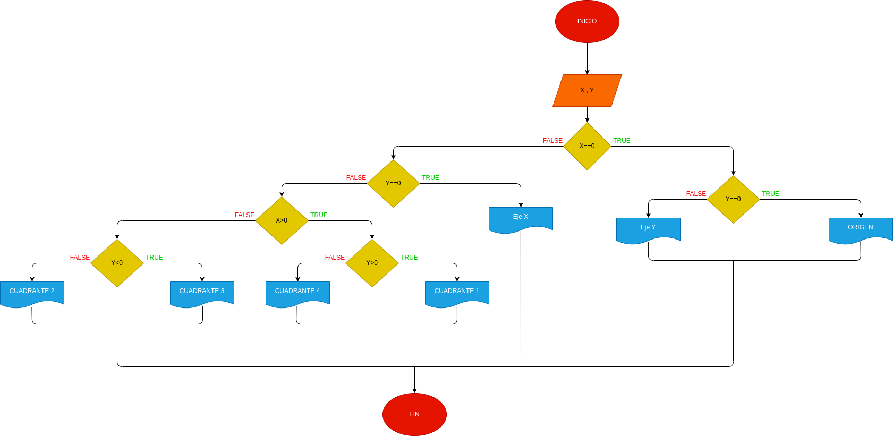

# EJERCICIO N°1

## ANALISIS

Variables de entrada(input)

X: cordenada indgresada
Y: cordenada ingresada

RTA: Nos va a decir en cual cuadrante, o eje esta nuestra cordenada

variables de salida(processing, storage, output)

eje X

eje Y

cuadrante 1

cuadrante 2

cuadrante 3

cuadrante 4

origen

# DISEÑO

# CONSTRUCCION
