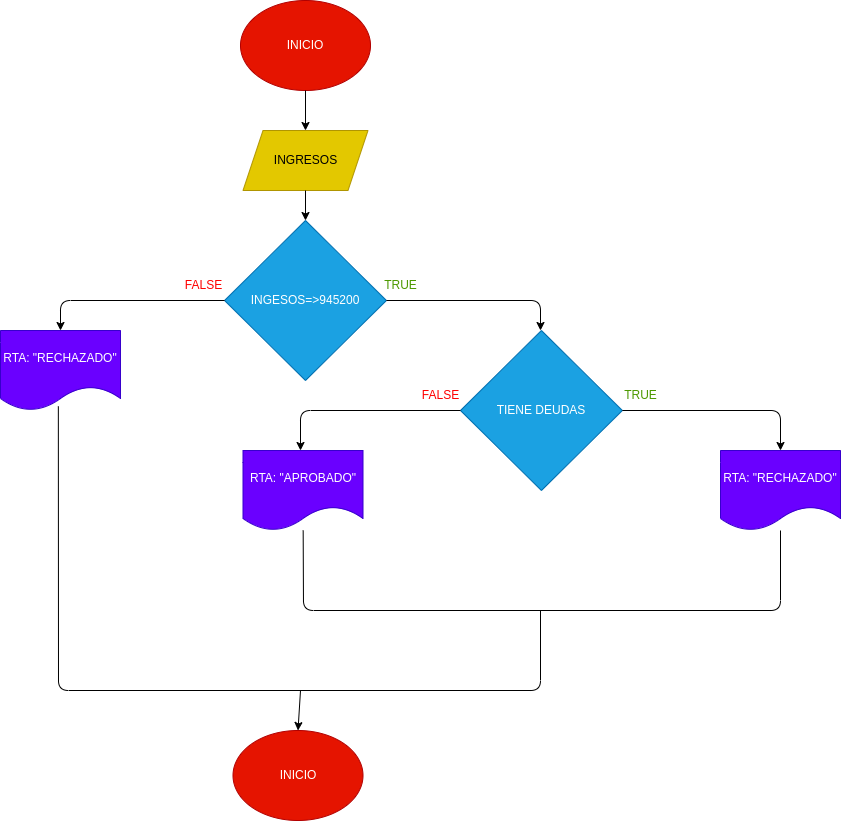

# EJERCICIOI N°2

## ANALISIS

Variables de entrada(input)

Ingresos: ingresos registrados

Deudas: deudas registradas

RTA: nos dira si nos aprueban o no el prestamo

Variables de salida(processing, storage, output)

aprobado 

desaprobado

# DISEÑO

# CONSTRUCCION